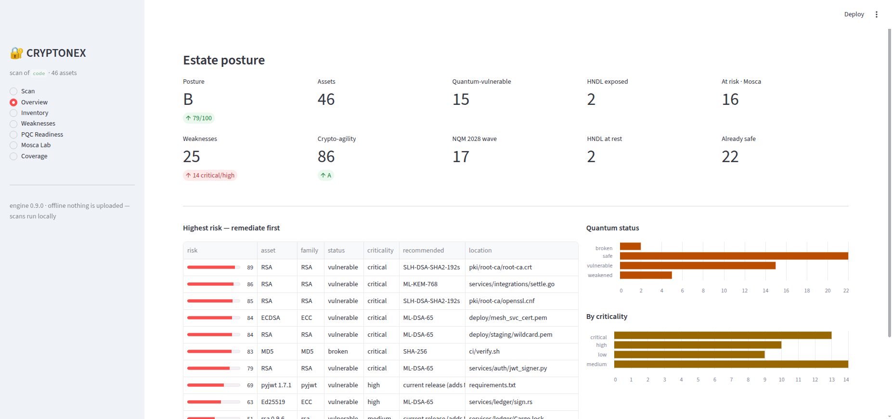
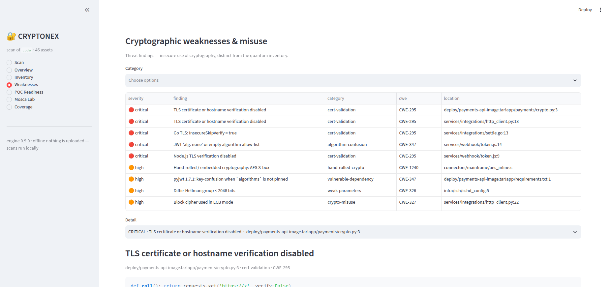
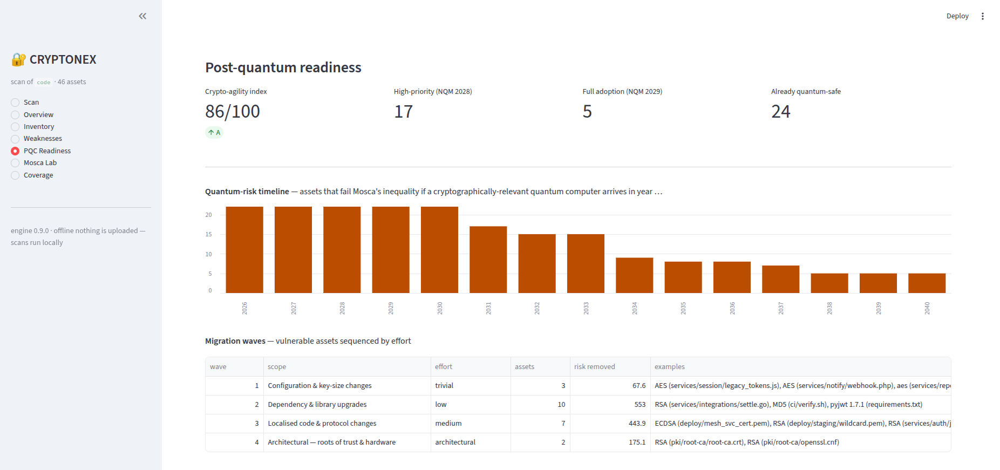

<h1 align="center">CRYPTONEX</h1>

<p align="center">
  <b>Cryptographic discovery &nbsp;·&nbsp; post-quantum risk assessment &nbsp;·&nbsp; migration planning.</b><br>
  <sub>You cannot migrate what you cannot see.</sub>
</p>

<p align="center">
  
  
  
  
  
</p>

---

CRYPTONEX scans a software estate — **source code, dependency manifests, certificates,
compiled binaries and container images** — and answers four questions an organisation
needs before it can move to post-quantum cryptography:

1. **What cryptography do we have, and where?** — a complete, evidence-backed inventory.
2. **How exposed is it to a future quantum computer?** — per-asset quantum-risk classification + **Mosca's inequality**.
3. **Which of it is dangerous today, regardless of quantum?** — 28 CWE-mapped cryptographic-misuse rules.
4. **What do we replace it with, and in what order?** — PQC / hybrid recommendations sequenced into migration waves.

It runs **fully offline** (built for air-gapped networks), emits a standards-compliant
**CycloneDX 1.6 Cryptographic Bill of Materials**, a **SARIF** report for CI, an executive
PDF/HTML report, and ships an **interactive local web console**.

> **Context.** Built for **Smart India Hackathon 2026, Problem Statement 26164**
> ("Enterprise Cryptographic Discovery & Analysis Tool"), **National Technical Research
> Organisation (NTRO)**. India's National Quantum Mission mandates cryptographic
> inventories for defence, power, telecom and BFSI by **December 2027** — this is the
> tool that produces one.

---

## Why this matters

Public-key cryptography — **RSA, ECC, Diffie-Hellman** — protects almost everything:
HTTPS, UPI, Aadhaar, VPNs, code signing. In 1994 Peter Shor showed that a large enough
quantum computer breaks all of it, completely. Symmetric crypto (AES) and hashes are
only weakened.

The threat is a **today** problem, not a 2035 problem, because of **Harvest Now, Decrypt
Later**: an adversary records your encrypted traffic now and decrypts it once a quantum
computer exists. Anything that must stay secret for a decade is already exposed.

The fix — NIST's **ML-KEM (FIPS 203)**, **ML-DSA (FIPS 204)**, **SLH-DSA (FIPS 205)** — is
standardised and ready. The hard part is the first step: **you can't replace cryptography
you don't know you have**, and it is scattered across code, dependencies, certificates,
binaries and container images with no single inventory.

---

## What CRYPTONEX does

```
        DISCOVER                      ASSESS                         RECOMMEND & PLAN
┌──────────────────────┐   ┌───────────────────────────┐   ┌────────────────────────────┐
│ source   (13 langs)  │   │ quantum status            │   │ PQC / hybrid target         │
│ dependencies (9 eco) │──▶│  safe / weakened /        │──▶│  ML-KEM · ML-DSA · SLH-DSA   │
│ certificates & keys  │   │  vulnerable / broken      │   │ NIST category · libs · effort│
│ binaries (ELF/PE)    │   │ Mosca:  X + Y  >  Z − now  │   │ migration waves              │
│ container images     │   │ business criticality      │   │ India NQM roadmap phase      │
│ hand-rolled crypto   │   │ HNDL exposure             │   │ crypto-agility index         │
│ 28 misuse rules      │   │ risk score 0–100          │   │ quantum-risk timeline        │
└──────────────────────┘   └───────────────────────────┘   └────────────────────────────┘
```

### The console

<p align="center"></p>

| Weaknesses (crypto-misuse findings) | Post-quantum readiness |
|---|---|
|  |  |

---

## Quick start

### Docker (nothing to install but Docker)

```bash
docker build -t cryptonex:local .

mkdir -p cryptonex-out
docker run --rm --user "$(id -u):$(id -g)" \
  -v "/path/to/your/repo":/scan:ro -v "$PWD/cryptonex-out":/out \
  cryptonex:local scan /scan --out /out

# then explore it in the browser:
docker run --rm -p 8713:8713 -v "$PWD/cryptonex-out":/out \
  cryptonex:local serve --result /out/result.json
```

### From source

```bash
python -m venv .venv && . .venv/bin/activate
pip install -e ".[dev]"

cryptonex scan /path/to/your/repo          # → cryptonex-out/{cbom.json, report.html, result.json}
cryptonex serve                            # → http://localhost:8713 (scan from the browser too)
cryptonex kb                               # knowledge-base inventory
pytest -q                                  # 39 tests
```

There is **no upload** — scans run entirely on your machine. The console's "Upload a
`.zip`" tab just unpacks the archive into a local temp folder and scans it there.

Full walkthrough for your own code: **[`ANALYZE_YOUR_CODE.md`](ANALYZE_YOUR_CODE.md)**.

---

## Commands

```
cryptonex scan <path|image.tar>
    --out DIR                       output directory (default: cryptonex-out)
    --format cbom,json,report,sarif
    --crqc-year 2032                Z — assumed year a quantum computer can run Shor
    --x N   --y N                   override Mosca X (data secrecy) / Y (migration time)
    --scanners source,dependency,certificate,misuse,container,binary
    --fail-on weakened|vulnerable|broken     non-zero exit for a CI merge gate
    --no-timestamp                  deterministic, byte-identical CBOM

cryptonex serve [--result cryptonex-out/result.json] [--port 8713]
cryptonex kb
cryptonex version
```

---

## Outputs

| File | What it is | Use it for |
|------|-----------|-----------|
| `cbom.json` | **CycloneDX 1.6 CBOM** — every asset with `cryptoProperties`, a dependency graph, a `vulnerabilities` array (misuse findings), and `cryptonex:*` risk / agility properties. Deterministic serial number. | Feed a GRC platform, an auditor, or a later migration tool. The interchange format. |
| `report.html` / `report.pdf` | Executive & audit report — posture grade, top risks, HNDL exposure, per-critical-asset **evidence vs. assessment** breakdown, post-quantum readiness, migration waves, methodology & limitations. | Leadership / auditor / submission. |
| `results.sarif` | **SARIF 2.1.0** — one rule per misuse type and per quantum class, `security-severity` set for code-scanning UIs. | CI PR annotations + merge gate. |
| `result.json` | The full `ScanResult`. | SIEM / data lake / the console. |

---

## How it works

**Pipeline + hexagonal core + plugin scanners.** The `domain/` package is pure — no I/O,
no framework imports — and holds the risk math. All cryptographic knowledge is
**versioned YAML** under `cryptonex/knowledge/`, so a new algorithm, library, advisory or
detection rule is a data change, not a code change.

```
CLI / web console
      │
      ▼
Orchestrator ──▶ scanners (source · dependency · certificate · misuse · container · binary)
      │                 │  RawFinding[]  +  SecurityFinding[]
      ▼                 ▼
   normalize (identity, dedup, dependency graph)
      ▼
   enrich  (algorithm → quantum status → lifetime → criticality → recommendation → Mosca)
      ▼
   posture  +  PQC-readiness analytics
      ▼
   reporters (CycloneDX CBOM · SARIF · PDF/HTML · JSON)
```

### Evidence vs. inference vs. assumption

Every asset carries an **`AssessmentBasis`** so a reviewer can tell fact from heuristic:

| Layer | Example | Trust |
|---|---|---|
| **Observed** | `RSA-4096`, at `pki/root-ca/root-ca.crt`, detected by the `certificate` collector, confidence **confirmed** | evidence-backed |
| **Knowledge base** | `vulnerable — Shor's algorithm recovers the private key by factoring the modulus`; recommend `SLH-DSA` (rule `rec.sig.longlived`) | deterministic, cited |
| **Inferred** | criticality `critical` — `pki(+22), root-ca(+15), external(+30), ca-key(+15), data:SECRET` | heuristic — verify before acting |
| **Assumed** | `X 20y + Y 5y = 25  vs  Z(2032) − 2026 = 6  →  exposed ~19y` | operator-configurable; not a prediction |

CRYPTONEX does **not** claim to discover organisational truth about data sensitivity or
business criticality — it infers a starting point from path and configuration signals and
says so, in the console, the report, and the CBOM (`cryptonex:*Basis` properties).

---

## Knowledge base

| | |
|---|---|
| Algorithm families | **42** — RSA · ECC · DH · AES · 3DES · SHA-1/2/3 · ChaCha20 · Camellia · ARIA · SM2/3/4 · GOST · **ML-KEM · ML-DSA · SLH-DSA · FN-DSA · HQC · XMSS · LMS** |
| Source detection rules | **162** across **13 languages** — Python, Java/Kotlin, JavaScript/TypeScript, C#, Rust, PHP, Ruby, Swift, Go, C/C++, config (nginx / Apache / HAProxy / Postfix / IPsec / **sshd_config**), shell |
| Dependency ecosystems | **9** — pip, npm, Maven/Gradle, Go, **Cargo, NuGet, RubyGems, Composer, CocoaPods** |
| Crypto libraries catalogued | **80** with end-of-life / advisory flags |
| CVE / RUSTSEC / GHSA advisories | **13** — matched by version range (CVE-2022-29217 PyJWT, CVE-2020-26160 `dgrijalva/jwt-go`, RUSTSEC-2023-0071 `rsa` crate, …) |
| Crypto-misuse / threat rules | **28** — disabled TLS verification, ECB, static IV, hardcoded keys, weak RNG, RSA < 2048, JWT `alg:none`, legacy TLS/SSH config, non-constant-time MAC compare, fixed ECDSA nonce, … |
| Hand-rolled-crypto fingerprints | **28** — AES S-box, SHA/MD5 tables, Blowfish P-array, DES/GOST/SM4 S-boxes, NIST P-256 / Curve25519 primes, ChaCha20 σ, bcrypt magic, BLAKE2b IV |
| PQC recommendation rules | **9** — RSA/ECDSA sign → ML-DSA-65 · roots of trust → SLH-DSA · key exchange → ML-KEM-768 + X25519 hybrid (TLS 1.3 / RFC 9370) · 3DES → AES-256-GCM · PBKDF2-SHA1 → Argon2id |

`cryptonex kb` prints the live inventory.

---

## Benchmark — real open-source repositories

`scripts/benchmark.py` clones seven well-known projects, scans each, and writes a summary
plus a precision spot-check sheet ([`docs/benchmark/`](docs/benchmark/)). Scans complete
in seconds; test-fixture crypto is separated from production crypto.

| repo | assets (test) | findings (test) | grade | time |
|---|--:|--:|:--:|--:|
| `pyjwt` | 1 (12) | 2 (16) | A | 0.5s |
| `paramiko` | 5 (20) | 4 (13) | A | 1.1s |
| `python-jose` | 9 (2) | 0 (11) | A | 0.3s |
| `golang-jwt` | 3 (11) | 5 (1) | A | 0.2s |
| `pyca/cryptography` | 21 (10) | 31 (98) | A | 4.6s |

---

## Where CRYPTONEX fits

| Capability | CRYPTONEX | IBM Guardium Quantum Safe | SandboxAQ | cbomkit (OSS) |
|---|:--:|:--:|:--:|:--:|
| Source-code discovery | ✅ 13 langs | ✅ | partial | ✅ 3 langs |
| Dependency discovery | ✅ 9 ecosystems | ✅ | – | – |
| Certificate / key discovery | ✅ | ✅ | ✅ | – |
| Binary discovery | ✅ (`lief`) | ✅ | – | – |
| Container-image discovery | ✅ (offline, layer-merge) | ✅ | – | ✅ (theia) |
| **Crypto-misuse / threat finding** | ✅ 28 CWE-mapped rules | partial | – | – |
| Quantum risk + Mosca | ✅ | ✅ | ✅ | flag only |
| PQC / hybrid recommendation | ✅ | partial | partial | – |
| **Crypto-agility index + migration waves** | ✅ | partial | – | – |
| **India NQM roadmap mapping** | ✅ | – | – | – |
| CycloneDX CBOM + SARIF | ✅ | ✅ | ✅ | CBOM only |
| **Fully offline / air-gapped** | ✅ | – (SaaS) | – (SaaS) | self-host |
| Cost | free | $$$ | $$$ | free |

---

## Not built yet (roadmap)

Two artefact types from the problem statement need live infrastructure access and are
**opt-in scanners behind the same plugin interface** — `HARDWARE_MODULE` and
`CLOUD_SERVICE` are already in the model. See
**[`docs/ROADMAP_HSM_CLOUD.md`](docs/ROADMAP_HSM_CLOUD.md)**.

| Collector | Needs | Offline test double |
|---|---|---|
| **HSM / TPM** (PKCS#11) | `python-pkcs11`, the vendor module, a slot PIN | SoftHSM2 |
| **Cloud KMS** (AWS / Azure / GCP) | cloud SDKs, a read-only role | `moto` / LocalStack |

Detection is currently regex + constant-fingerprint based (the M0 layer); AST /
tree-sitter analysis is the next precision layer and slots in behind the same scanner
interface.

---

## Project layout

```
cryptonex/
  cli.py                     Typer CLI
  domain/                    pure — models, Mosca + risk math, recommendation, posture,
                             PQC-readiness analytics, path heuristics
  knowledge/                 versioned YAML — algorithms, aliases, libraries, advisories,
                             pqc_mapping, policy, constants, misuse, rules/<lang>.yaml
  scanners/                  source · dependency · certificate · misuse · container · binary
  core/                      orchestrator · normalize · enrich
  reporters/                 cbom · report · sarif · json
  gui/streamlit_app.py       the web console
tests/                       39 tests + a synthetic "vulnerable-repo" corpus (13 languages)
                             + a docker-save image tar
scripts/benchmark.py         real-OSS benchmark harness
docs/                        CAPABILITIES · DEMO · HOW_TO_PRESENT · ROADMAP_HSM_CLOUD · benchmark
Dockerfile · compose.yaml · Makefile
```

---

## Documentation

| Doc | Contents |
|---|---|
| [`ANALYZE_YOUR_CODE.md`](ANALYZE_YOUR_CODE.md) | Point CRYPTONEX at your own codebase — every way to run it |
| [`docs/CAPABILITIES.md`](docs/CAPABILITIES.md) | Full capability list + comparison detail |
| [`docs/DEMO.md`](docs/DEMO.md) | 5-minute demo script (verified on Docker) |
| [`docs/HOW_TO_PRESENT.md`](docs/HOW_TO_PRESENT.md) | Framing, the one-asset demo spine, judge Q&A |
| [`docs/ROADMAP_HSM_CLOUD.md`](docs/ROADMAP_HSM_CLOUD.md) | The two remaining collectors — exact build plan |
| [`BUILD_STATUS.md`](BUILD_STATUS.md) | What's built, knowledge-base counts, changelog |

---

## License

Apache-2.0.
